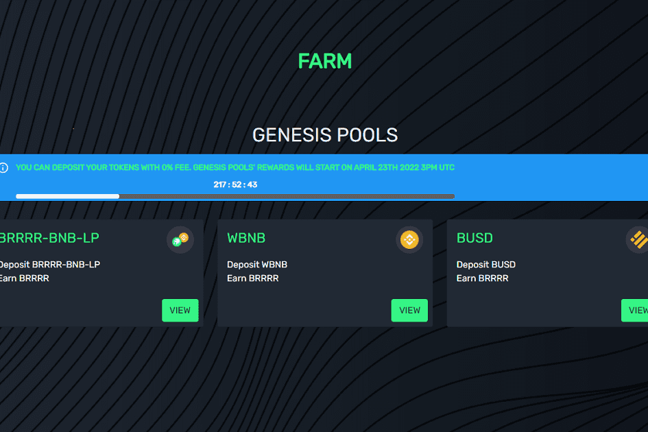

# Equilibrrrrium Money

目的
EquiliBRRRRium 是一个 algostablecoin 铸币税协议。目标是为其基础 BRRRR 资产提供一种方法，以维持一个在算法上以 10 000:1 的比率与 BNB 价值挂钩的价值。
那么，这有什么好处呢？我们将在本文档中进一步探讨这个想法，但目前无需太技术化，这为现有的长期 BNB 持有者、已经熟悉 DeFi 的人以及刚刚进入该领域的新用户打开了一个充满可能性的世界.随着 EquiliBRRRRium 生态系统随着时间的推移而发展，潜在的未来应用几乎是无穷无尽的。而且，随着您继续阅读本文档并了解有关 EquiliBRRRRium 协议如何工作的更多信息，我们将更详细地探索其中的一些潜力。
BRRRR 是 EquiliBRRRRium 协议的原生代币。协议中内置的稳定机制旨在长期维持 BRRRR 的 10,000 BRRRR = 1 币安币（BNB）的挂钩。
EquiliBRRRRium 协议代币是什么？
BEquiliBRRRRium 的多代币协议目前由以下 3 个代币组成，每个代币都在协议如何维持挂钩方面发挥着关键作用：
1- EquiliBRRRRium 代币（$BRRRR）：设计用作交换媒介。 $BRRRR 在算法上以 X BRRRR 与 1 BNB 的比率与币安币 (BNB) 挂钩
2- EquiliBRRRRium 股份 ($BRRRRSHARE)：BRRRRSHARE 可以在董事会中质押，以赚取一部分铸造的 BRRRR，作为对那些 BRRRRSHARE 持有者投资于协议的健康和稳定性的奖励。
3- EquiliBRRRRium 债券 ($BRRRRBOND)：BRRRRBOND 的主要工作是帮助激励和奖励用户在供应收缩低于挂钩时帮助恢复挂钩。
