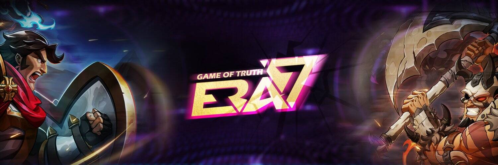

# Era7: Game of Truth

Era7: Game of Truth 是一款元宇宙风格的 TCG，由币安智能链（BSC）开发，由区块链核心技术人员和知名休闲游戏开发公司成员共同打造。
这是一款令人上瘾但最先进的纸牌交易游戏，它使用了一种开创性的新游戏方法。战斗与策略的完美结合，让这款游戏变得令人激动的身临其境，并被分成独立的三分钟游戏。
玩家可以通过不同的方式组合自己卡牌库中的卡牌，以确保他们的牌组尽可能的强大。他们可以通过部署和放置卡片来玩 PVE 或 PVP。不同的卡牌有不同的效果，无论是普通卡牌还是传奇卡牌，玩家都会热衷于收集它们。玩家不仅要观察自己的牌组，还要仔细观察对手的动作和位置。这为玩家提供了随着时间的推移练习和发展他们的游戏技能的动力，同时接受类似于国际象棋选手所接受的出色的大脑训练。只是，这种训练表现在熟练地使用英雄，骑着成千上万的人上战场。
当然，除了游戏好玩之外，玩家的每一张牌都有自己的价值。玩家可以通过收集、战斗、交易、召唤或合成某些卡牌来获得高价值的卡牌。这也是GameFi与传统游戏相比最大的魅力之一。 Era7将不断更新游戏内容，增加新卡牌、玩法和战斗通行证，满足玩家持续需求的同时全面创收。 Era7的早期玩家将享受生态红利。我们有一个奖励机制来邀请朋友和分享游戏。 Era7 为来自不同背景和垂直市场的个人和组织提供了一整套盈利模式。
