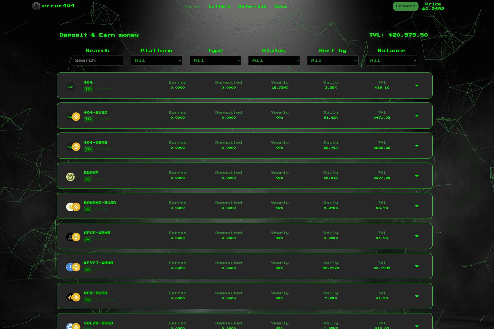

# Error404 Finance

什么是错误 404 (404) 令牌？
Error 404 (404) 是 Error404.finance 生态系统的原生代币。 Error404.finance 是托管在币安智能链 (BSC) 上的收益优化器，具有投票实用程序，允许 404 持有者参与并投票支持社区提供的未来改进或倡议。
如何获得404？
404 代币在 Pancakeswap 上交易，Pancakeswap 是托管在币安智能链 (BSC) 上的领先去中心化交易所 (DEX) 之一。 Pancakeswap 是一个自动做市商 (AMM)，它允许用户购买 404 个代币并立即将它们与 Pancakeswap 上列出的其他 BEP-20 类型的代币进行交换。
什么是 Error404.finance？
创建 Error404 金融的目的是通过将存入生态系统的资本的 100% 利润用于其他更高收益的奖励项目，从而最大限度地提高收益和回报。通过这样做，Error404 是唯一将利润重新投入到更高收益奖励中的项目，以与从 TVL 获得的初始利润相结合，这使得所存资本的利润不断增长，从而产生收益并为两者提供更高的回报用户和开发者。

