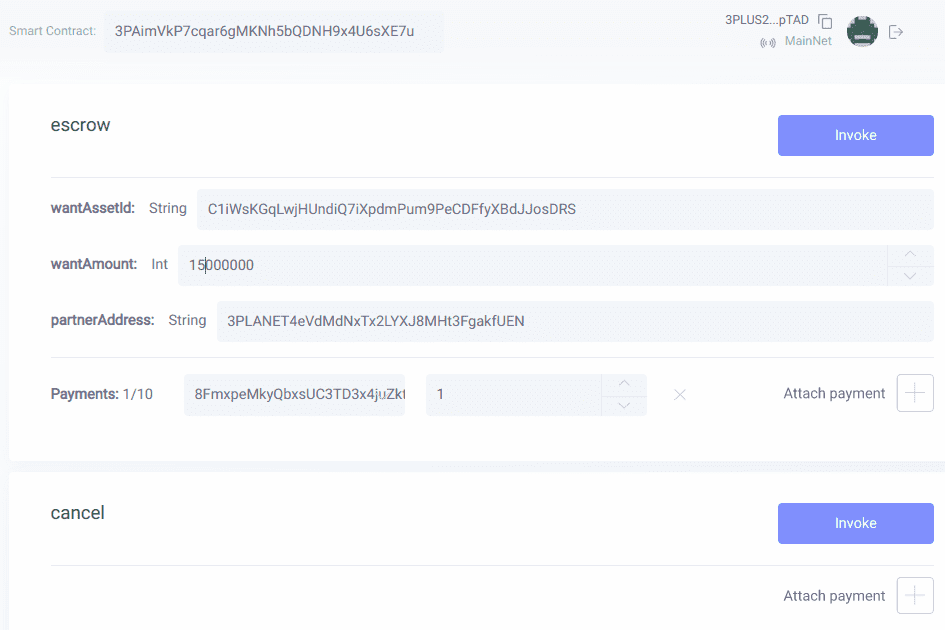

# Escrow

此 dApp 允许在两方之间交换 Waves 区块链上的任何代币，而无需相互信任。这个怎么运作：
1. 双方就他们想要和提供的资产 ID 和数量达成一致。他们告诉对方他们的钱包地址
2. 双方合作伙伴都使用这个 dapp。
使用适当的方法连接您的钱包（登录）。
通常，每个合作伙伴需要调用的唯一功能是 escrow
需要通过的参数：
WantAssetId - base58 字符串，例如 DG2xFkPdDwKUoBkzGAhQtLpSGzfXLiCYPEzeKH2Ad24p (USDN assetsId)。如果您需要 Waves，只需输入 WAVES
WantAmount - 您想要的资产的整数金额值。例如，如果您需要 1.5 USDN，则通过 1500000
partnerAddress - 您的合作伙伴告诉您的钱包地址
您提供的相应资产应作为付款附加 - 从下拉列表中选择适当的资产 ID 并输入金额（作为浮点值）
当最后一个合作伙伴调用托管时，交换发生并且资产到达各自的钱包
3. 如果由于某种原因您无法完成交易，只需调用取消，您的资产将返回您的钱包
请注意，调用智能合约需要 0.005 Waves（Waves 网络标准）。不收取其他费用

