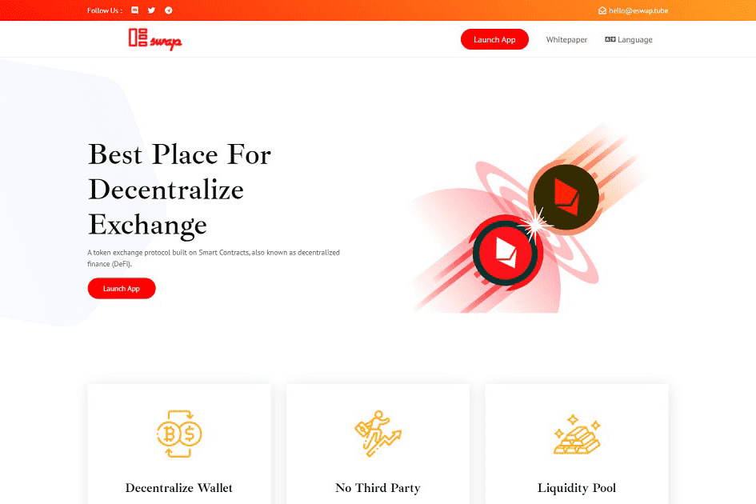

# Eswap.tube

Eswap.tube 是目前正在开发的创新 DEX，旨在解决 DEX 当前面临的问题。 Ewap 协议是 Quatro 网络的子扩展，并神经链接网络中的其他协议。它是使用 ERC20 智能合约作为其基础技术创建的，并调整了 DeFi 服务以适合用户和投资者。Eswap 协议将使您能够立即从您的 Dapps 钱包服务提供商处交换加密代币。不需要KYC或注册过程，也不需要存款来进行掉期。以简单的形式执行智能合约是 Eswap 内买卖过程的基石。Eswap 将应用安全的流动性协议为平台内的贸易生态系统提供资金。用户将被允许直接通过他们的钱包成对提供流动性，无需任何形式的注册。
流动性提供者将在 Eswap 平台上进行的每笔交易赚取 0.4% 的佣金。这是市场上最具激励性的流动性池之一。Eswap 团队将激活多对流动性挖掘。这些也被称为农场。这些可以通过几个简单的点击输入，用户可以在 Eswap 平台上质押他们的加密代币。我们为用户提供了一个完美的代币挖矿替代方案。在这些流动性矿场中，投资回报将以 tube2 代币支付。 Eswap 也采用恒定乘积做市商（AMM），AMM 基于函数 x*y=k，根据每个代币的可用数量（流动性）确定两个代币的价格范围。为了保持产品 K 不变，当 X 代币的供应量增加时，Y 代币的供应量会相应减少，反之亦然。）
