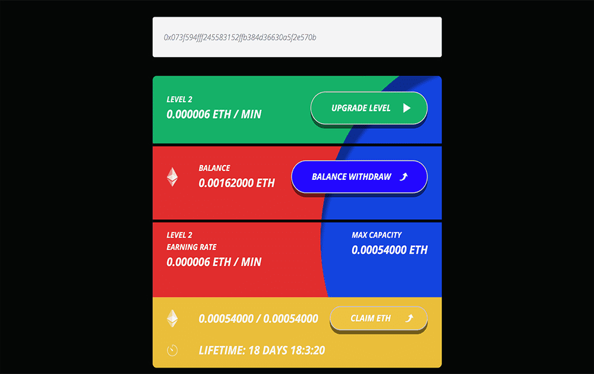

# ETH Flow

区块链上的以太坊水龙头。简单的条件。通过加入我们的项目，一个 ETH 水龙头开始为您工作，每 3 小时它会为您带来免费的 0.00036 ETH。 ETH Flow 是一种新型的以太水龙头——它实际上与用户分享了 90% 的收入。显示横幅并让您填写验证码的传统水龙头不起作用：即使赚一美元也需要几个小时，然后您必须花费数十个小时才能达到第一个支付门槛。基于广告的水龙头本质上是一个骗局。 ETH Flow 具有完全不同的模型。当我们的会员购买更高级别的访问权限时，我们会重新分配他们存放的以太币。您的等级越高，您每分钟赚取的以太币就越多。每个级别都会在有限的时间内保持活动状态，之后您可以更新它或购买更高的级别以最大化您的收入。我们的以太重新分配机制是完全透明的，并由专门设计的算法执行。使用 ETH Flow，您无需花费数小时查看广告和进行验证码。您所要做的就是选择您想要的级别并等待您的以太币累积。联属网络营销计划 只需打开“联属网络营销计划”——您就会在其中找到您的个人推荐链接。复制它并将其发送给您的朋友和关注者，在您的社交媒体帐户或博客中发布。我们的系统会自动跟踪谁使用您的链接加入。您将获得您推荐人赚取的所有以太币的 20%！无限可能。使用升级系统，可以成倍增加水龙头的收入，因为这是该项目的核心思想。使用 ETH FLOW 变得独立！

