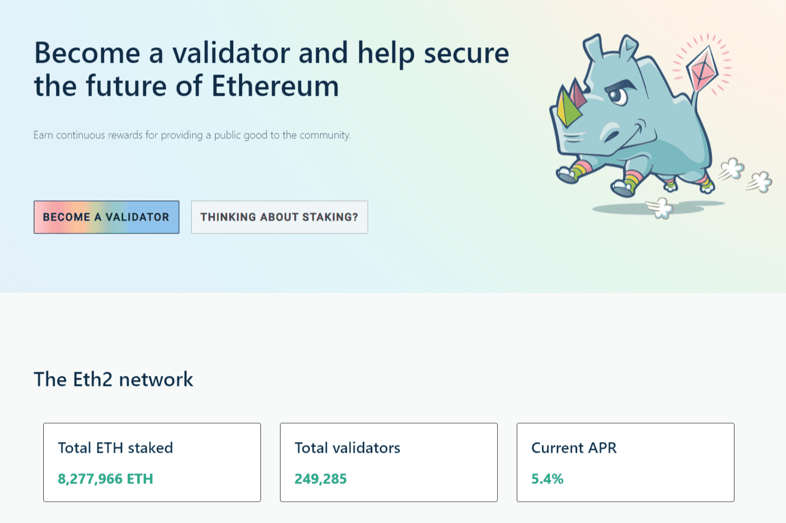

# ETH2 Deposit Contract

成为验证者
成为验证者是一项重要的准备步骤。只有在您准备好后才开始存款过程。
验证器常见问题解答
只有验证者了解风险和责任，Eth2 升级才会成功。
硬件检查
list 你需要运行一个 Eth1 和一个 Eth2 节点才能成为验证者。查看清单以准备好您自己和您的设备。
试试测试网
我们建议您首先在测试网上完成整个过程以适应。
钓鱼指南
确保您了解如何避免网络钓鱼攻击。我们准备了一份需要注意的事项清单。
开始存款流程
一旦你感到舒服，你将完成生成你的密钥并存入你的 ETH。
🕰等待变得活跃
设置后，您的验证器不会立即激活。利用这段时间完成清单并在测试网上进行一些额外的练习。

