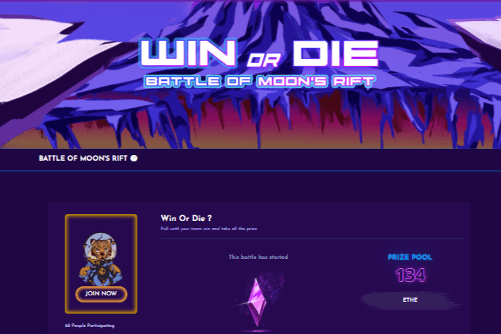

# ETHEKing

ETHEKing 由 NetSky 工作室开发，该工作室成立于 2016 年初，专注于 Android、iOS 平台和区块链上的手游。
ETHEKing：让我们去月球
第 1 阶段 - 未来之王
玩家将率先在月球上拥有自己的土地，成为探索的先驱，并且能够直接从这些月球土地上开采 ETHE 也为未来建立一个强大而繁荣的王国创造了前提（阶段2）在月球上。
每个 Lands 都是一个 NFT，可增加所有权和可交易性，您还可以在游戏中寻找其他 NFT 物品。
ETHE 是一种极其宝贵的资源。月球上王国的快速增长使得土地和资源的争端不可避免。每个王国都必须在前所未有的战争中挺身而出。
第 2 阶段 - 列王之战 (CoK)
在人类的发展过程中，有一个明确的道理，哪里有资源，哪里就有战争。越来越多的人离开地球去寻找星星，新的王国不断建立，月球上到处都出现了冲突。谁能够得到强化和强化，最强的军队将成为最强大的月之王。

