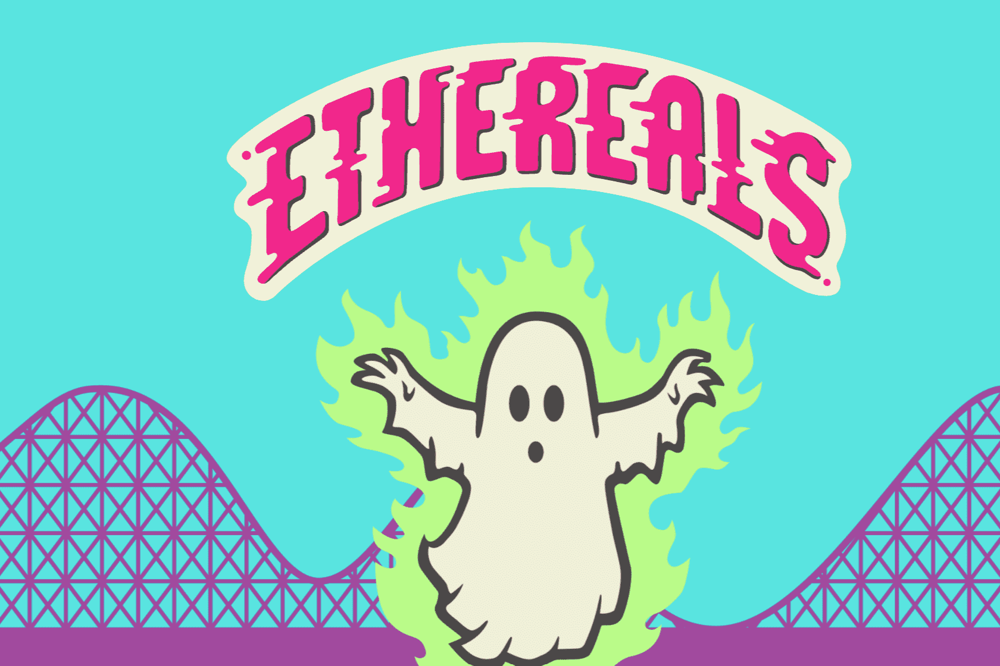

# ETHEREALS WTF

ETHEREALS 是 12,345 个手绘、随机生成的跨维度幽灵。他们的特征来自于元宇宙的各个方面，包括令人惊讶的文化参考混搭，一直到超级内部稀有。他们是穿越时空寻找乐趣的永恒存在！
有关 ETHEREALS 故事的更多详细信息，请访问 ethereals.wtf 并查看我们的 Discord！
Jimmy Danko 是这些跨维度幽灵背后的艺术家，并且是 NFT 社区的活跃参与者。他煞费苦心地手绘了所有的以太，然后将它们数字化。他是 Mayhem Island Bananas 的创作者，以玩具和流行文化偶像的超写实油画而闻名——他的作品被世界各地的私人收藏。

