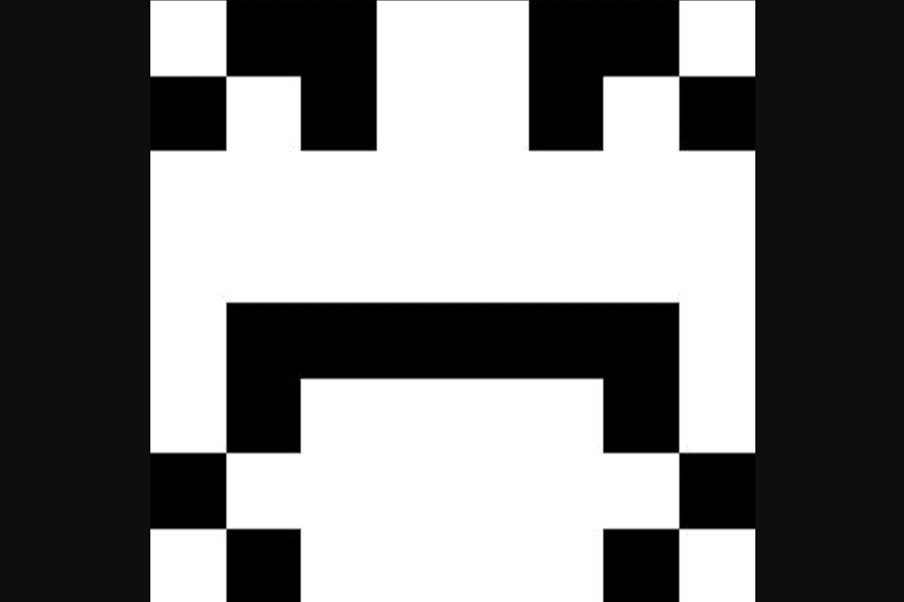

# Etholvants

Etholvants 是生活在以太坊区块链上的 100% 链上生成、通货紧缩和不断进化的生物。
规则很简单。有 10,000 种独特的 etholvants 可供铸造，每个价格为 0.024 ETH。它们最初将带有 24 个细胞，它们可以通过质押或组合来进化。
如果你将一个 etholvant 投入到合约中，它会在每 4 小时内增长 2 个细胞。因此，如果您用 24 个单元放置一个单元，一天后它将有 36 个单元。
如果您将多个 etholvant 组合在一起，它们将被烧毁并创建一个新的。它的细胞数将等于燃烧细胞数的总和。因此，如果您将两种 etholvants 与 24 个细胞和 40 个细胞结合起来，您将得到一种具有 64 个细胞的细胞。
合并和质押是免费的（只有汽油费），每笔交易的取消质押费用为 0.01 ETH（您可以在每笔交易中取消质押多个代币）。随着 etholvant 的发展，艺术的规模也会增加。
一切都在链上，包括艺术品，您可以从合约中获取单元格的位置。 Etholvants 是标准的 ERC721 代币，因此您可以在 OpenSea 上买卖它们。

