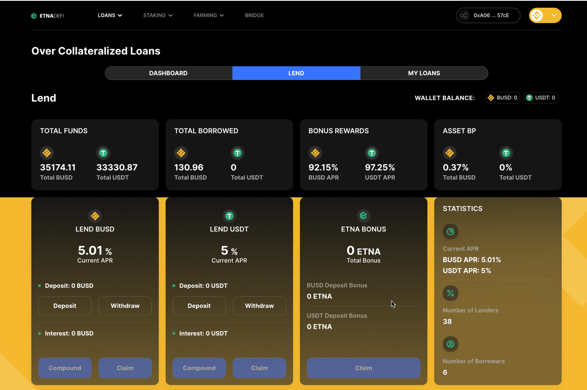

# Etna DeFi

Etna DeFi 是由 Etna Network 开发的全能 DeFi 套件。它为用户提供了对 DeFi 应用程序的访问，例如贷方和借方的算法货币市场、抵押和收益农业应用程序以及使用户能够将代币和 NFT 从一个区块链交换到另一个区块链的跨链桥。
算法货币市场是 Etna DeFi 中的主要 dApp 之一，它是加密空间中用户最友好的借贷 dApp 之一。除此之外，它还具有以下优点。
1. 它是第一个支持使用列入白名单的 NFT 作为抵押品的算法货币市场。
2. 使用 Etna 代币或 NFT 作为抵押品时，贷款是免息的
3. 稳定币出借人双赚；即，他们赚取利息并从存款中赚取高额红利。
由于 Etna Network 团队正在努力彻底改变这个空间，他们也在研究一种 B2B 货币工具，这将成为团队正在开发的自偿还贷款机制的组成部分。
该团队还在研究抵押不足的贷款协议。随着这项服务的推出，用户将能够在多个 DEX 上进行交易/套利，其资金最多是他们实际拥有的资金的 5 倍。
Etna DeFi 还为用户提供代币/NFT 质押和农业的访问权限。最后，一个跨链桥使用户能够方便地将代币和 NFT 从一个桥转移到另一个桥。
4. 
