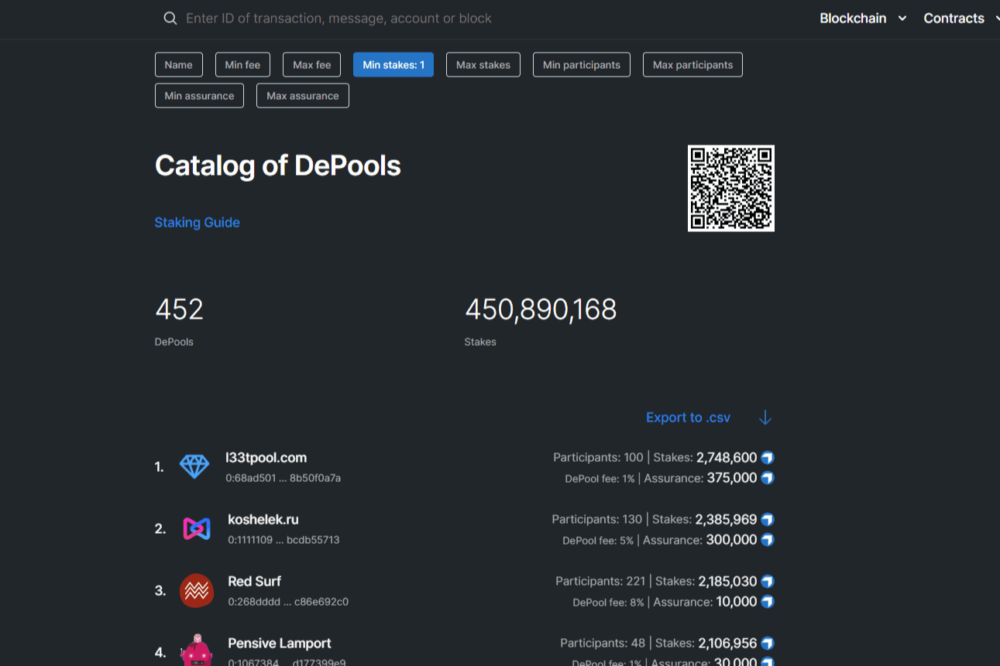

# Everscale DePools and Staking

Everscale 是一个去中心化的全球区块链网络，每秒能够处理数百万笔交易，具有图灵完备的智能合约和去中心化的用户界面。
Everscale 中有超过 450 个 DePool，它们为用户提供了将他们的代币添加到验证者资金并从质押中获利的能力。
DApps、集成的去中心化机器人（DeBots）、TONOS-CLI 和其他智能工具有助于轻松地在 Everscale 网络中质押。
收入快。控制您的资金和收入的每日收入
安全又可靠。 Everscale Blockchain 让您保持匿名，没有人可以影响您的奖励
完全控制。没有奖励损失 - 随时提取您的资金不足
最大收入。随时补货以增加收入
您的参与。对区块链和去中心化的贡献

