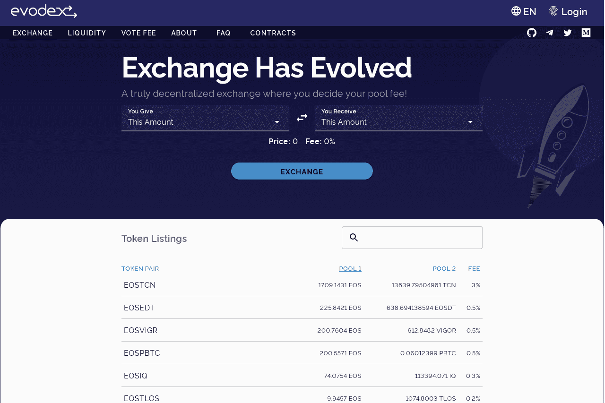

# evodex

Evodex 是两个区块生产者对 EOS DE-FI 生态系统的共同贡献。
智能合约由 EOS Argentina 创建，它允许任何人在去中心化交易所启动并与持续流动性池进行交互。前端和 Web 界面由 EOS Costa Rica 提供，作为访问 Evolution Dex 协议的桥梁。凭借这一贡献，两个团队都希望帮助促进 EOS 上的去中心化金融的发展，EOS 是一个区块链，由于其交易能力和免费模式，具有运行复杂系统的最佳能力。
Evodex 促进了交易所的去中心化，并促进了 EOS 在金融工具中的使用。该项目是完全开源的，对于希望将其集成到前端的任何开发人员都是免费的。通过这种方式，不同的交易所可以共享相同的流动性并为协议的发展做出贡献。
与以太坊上的 Uniswap 的主要区别在于，流动性提供者可以使用智能合约投票决定他们想要收取的费用，该合约计算与池中每个参与者的股份成正比的费用。
EVODEX 和 UNISWAP 之间的另一个区别来自它们都在运行的不同区块链，交易者只需向流动性提供者支付费用，但他们不必像以太坊和其他网络那样支付转账费用。
