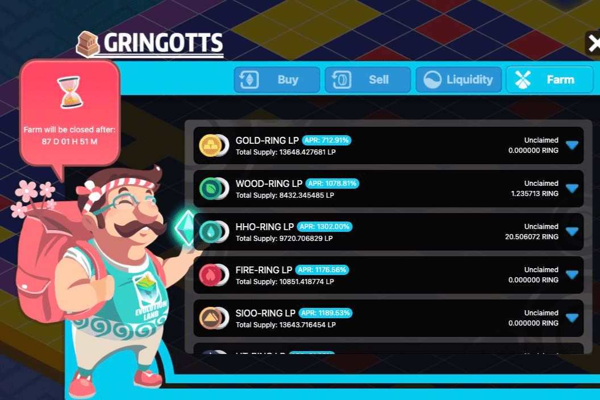

# Evolution Land

Evolution Land是第一个Defi+NFT跨链游戏，每个大陆都建立在不同的区块链网络上，比如第一个亚特兰蒂斯大陆。游戏将有多达 26 个大陆，每个大陆都部署在不同的公链上。目前已建成四大洲，分别部署在以太坊（Atlantis Continent）、Tron（拜占庭）、Columbus（Crab Network）、Dawning（Heco）。
Evolution Land整合了管理、收集、教育、基因、战斗、拍卖、游戏等多种玩法，将不断进化。
玩赚
玩家拥有 NFT 土地，可以在其中放置 NFT 挖矿工具“Drills”和挖矿角色 Apostles 来挖掘 5 种资源并建造建筑。未来，还将推出更多跨大陆贸易、战争、使徒战斗等功能。
一Dapp 一社区元界
10+项目已宣布计划在Evolution Land建立社区，以展示项目信息并回馈社区粉丝。

