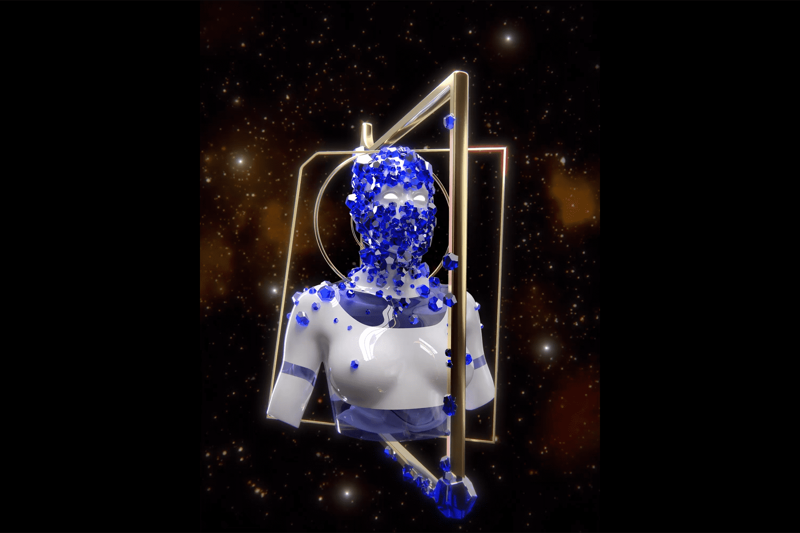

# Exclusible Alpha

Exclusible 是一家初创公司，其诞生的唯一目的是通过打开 NFT 的世界及其巨大潜力，将奢侈品牌进一步推进数字化转型。该平台将允许收藏家在五个垂直领域访问世界上最令人向往的奢侈品牌的限量版 NFT 和体验：时尚、手表、珠宝、美容和超级跑车。
Exclusible 将于 10 月 22 日发布他们的第一款产品，名为 Alpha Collection。这将是市场自己的 NFT 项目，充当私人俱乐部访问密钥，为奢侈品牌合作伙伴的所有未来下降提供广泛的特权。 Alpha Collection 将总共包含 3,000 个 NFT，涵盖四种不同的设计，每一种都代表 Exclusible 解决的产品细分：时尚、手表、珠宝和美容。每个 NFT 将花费 0.2 ETH，并且将是具有增强现实功能的 3D 设计。

