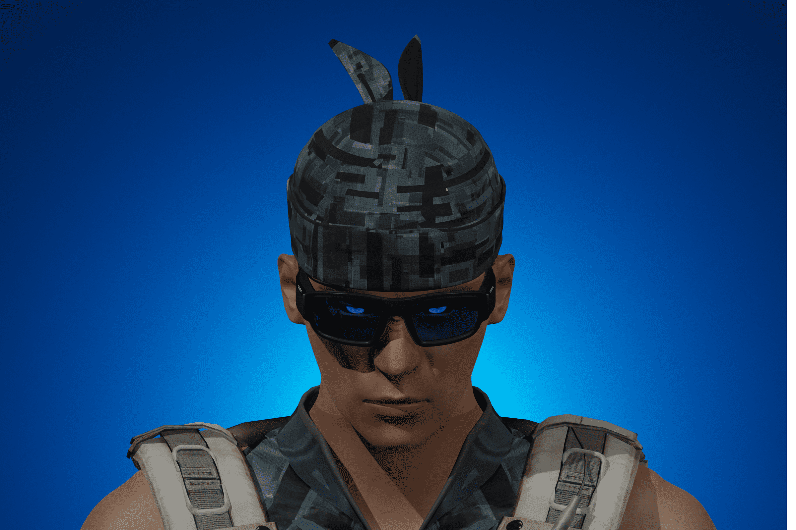

# Fabwelt

FabWelt 是一个革命性的元界生态系统，专注于通过在高端游戏中利用区块链技术来改善游戏环境。
FABWELT 生态系统的目标是通过游戏内 NFT、Play to Earn 和游戏内 DeFi 来放大游戏的乐趣。 Fabwelt 团队正在构建区块链上最大的元界生态系统。这是通过融合区块链技术和高端游戏来实现的，这将吸引全世界的游戏玩家和艺术家。
Fabwelt 成为多边形上最好的游戏项目。结果由 Dora Hacks 组织的 Hackathon 的评委选出。

阿森纳是由 Fabwelt 开发的 3D 第一人称射击 FPS 游戏，具有独特的游戏内 NFT 作为实用程序和 Play to Earn 功能。阿森纳将举办每周和每月的锦标赛，这些锦标赛将在一系列非凡的地图上展开。使用集成在区块链上的 Unity 开发！

