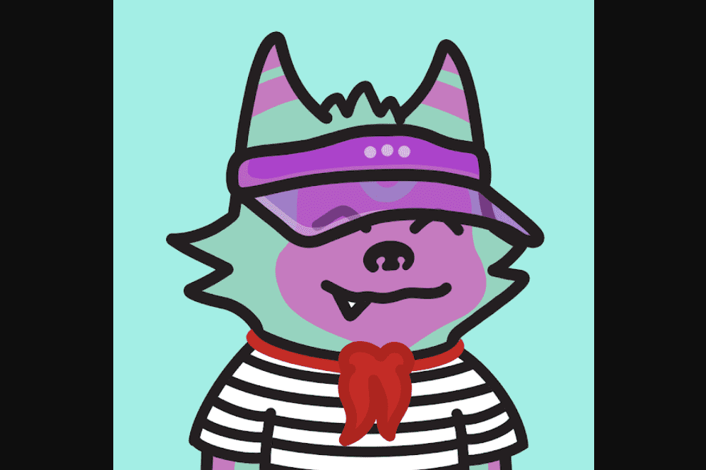

# Fang Gang

有些人会说他们是狼。其他人说他们是猫。也许是狐狸？！我们可以肯定的是，它们是随机生成的具有最狂野态度的 NFT 生物，由 160 多种特征和 3.676.470 种可能的组合组合而成。

Fangsters得到了滴水。每个 Fangster 都由头部、面部、身体、皮毛和背景特征组成。每个人都反映了他们的个性。当晚上出去举办派对或只是在后巷闲逛时，他们会通过自己的风格来表达自己。他们的特征可以是常见的、不常见的、稀有的或神秘的。有些人比其他人更兴奋，但他们都适合Fangster。当然，每个帮派都有他们的首领，所以有些 Fangster 是 Special - 1/1 版本，这意味着没有人会咬他们的脚趾。你会在晚上听到他们在街上嚎叫谁的酱汁最多。

