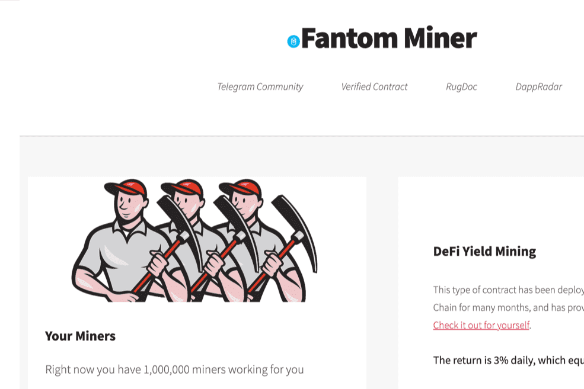

# FANTOM MINER

基于流行的 BNB Miner 项目，带到 Fantom 什么是 FANTOM Miner？
FANTOM Miner 不能与农场混淆。矿工不是被购买的，而是被雇佣的，因此不能被出售。一旦矿工被雇用，他们就会无限期地为您工作，以每天 3% 的起始费率为您提供无限量的 FANTOM。策略是个人的，你要么严格复合 AKA “雇佣更多矿工”，要么严格控制 FANTOM，要么将两者健康地结合起来。在我们看来，最好的策略是尽可能多地进行复利，同时考虑交易气体。一旦您对每天、每周或每月的结果感到满意，就可以在您认为合适的时候尽可能多地获利，然后继续将其余部分复利。
策略和附加信息：
已验证的公共合同
FANTOM Miner 合约是公开的、经过验证的，可以在 FtmScan 上找到。
FANTOM Miner 适用于希望获得长期利润和可持续性的用户。对于那些想要立即获利的人来说，最终会影响他人。
FANTOM Miner 每天支付 3% 的适度费用，让投资者高枕无忧，因为他们知道他们的投资具有无限的增长潜力和低于 3% 的最大、不可能的风险。
我们的算法允许每个参与者获得丰厚的利润，无论他们的策略如何，但它不会让任何一个参与者比其他参与者拥有不公平的优势。这真是一件美好的事情！
虽然 FANTOM Miner 算法确保所有参与者都能获得公平份额的奖励，但它还通过其复合选项 AKA “雇用更多矿工”来支持最支持的参与者。

