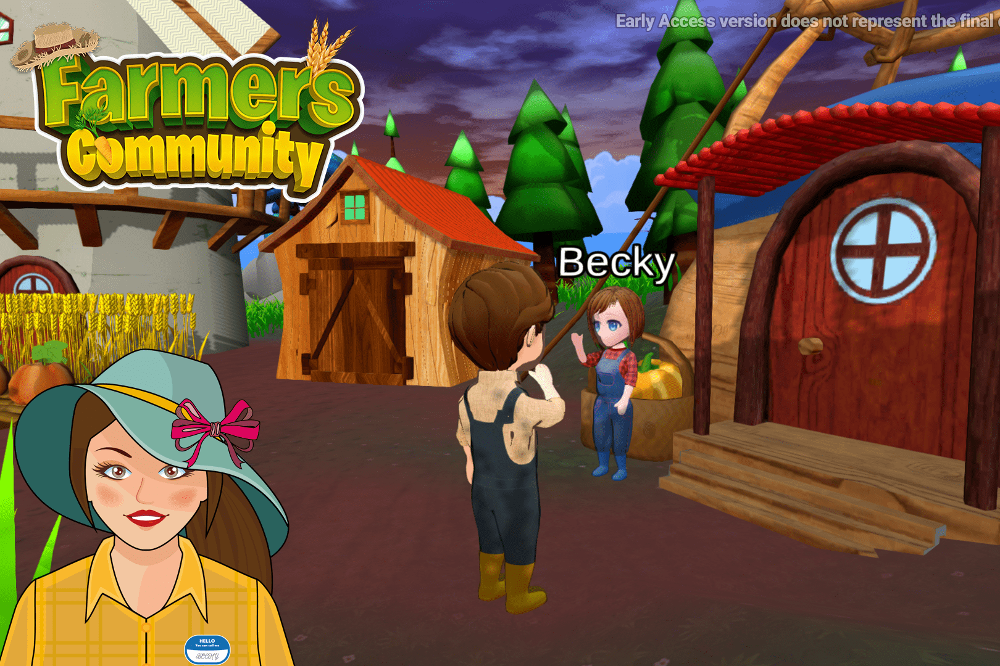

# Farmers Community

Farmers Community是一个区块链游戏，任何人都可以拥有自己的
一块虚拟的土地可以耕种，并结识新朋友一起耕种。
一个有趣的在线模拟器，让放松的游戏爱好者享受它的整体和
P2E 生态系统围绕它构建。
与您购买扩展包的其他农业模拟器游戏不同，
装饰品，在农民社区你将拥有这些资产和
总是能够在任何给定时间将其转售给其他人。
这不仅仅是一款区块链玩家的游戏，而是一款可以
向数百万玩过此类游戏的玩家介绍区块链
从他们还是个孩子开始的游戏！
一款以卡通/可爱视觉形象为基础的开放世界 3D 游戏
在大多数人的正面图像上，您可以在其中四处走动
拥有自己的农场岛或任何其他人的农场岛并帮助他们
任务。
无论您是与农民邻居闲逛，还是收割庄稼
自己一个人，或者和大家一起在你的农场举行钓鱼比赛
你知道 - 总有事情要做。

