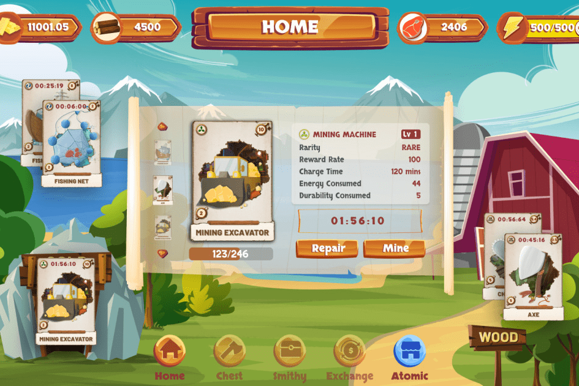

# Farmers World

Farmers World 是第一个在 NFTs 平台上运行的农场游戏。为自己挑选合适的工具，开发各种资源，购买土地来建造巨大的农场，并享受在农民世界生态系统中工作的农民的迷人经历。

最大的 NFT 游戏社区之一，在全球拥有超过 150000 名玩家。
有任何问题或只是想与其他探险家分享您的经验？我们的 Telegram 和 Discord 社区活跃而友好——您可以随时了解更多信息并在那里聊天。

农民世界会更新吗？这可能是我们在过去几个月中收到最多的问题。我们现在将通过另一个问题来回答这个问题：什么时候更新？

然而，我们生活在特殊时期。真正的战争导致货币战争。这可能是拖延的借口，但不管你喜不喜欢，这是事实。即使你讨厌黑暗，太阳仍然下山。

我们知道，有更新的要求，你已经投资了游戏，当然你希望它成长。但是，你们有投资，我们有 Top.3 区块链游戏。为什么我们停下来？？？

如果没有任何变化，下个月对于农民世界来说将是一个爆炸性的月份。希望你明白我们的意思。

