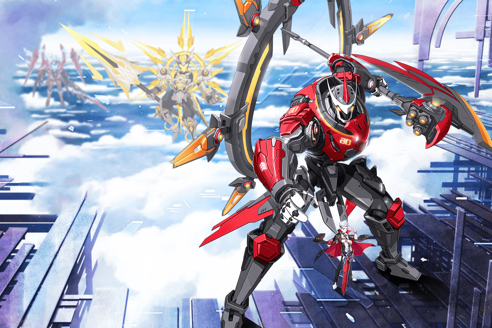

# Fate/Origin

《Fate/Origin》是第一款基于币安智能链开发的大型3D MMORPG游戏。它由JOJO Gamebase孵化，以中世纪剑与魔法的故事为蓝本。

在游戏中，您可以享受Play-To-Earn，精美的游戏画面和激动人心的实时战斗。游戏中还有宠物、坐骑、时装、翅膀等40种NFT，不仅能让你获得高额利润，还能体验华丽的特效。

NFT 有 4 种类型，分别是坐骑、宠物、时装和翅膀。每种类型下有 10 个 NFT。
坐骑不仅拥有可爱的外观，还增加了玩家的各种属性。
坐骑：荒地巨龙、雪原猛犸象、月罪狼、奥术冰狮、末日巨龙、水晶梦魇、魅惑狐狸、双足飞龙、钢铁猩猩、火凤凰。

