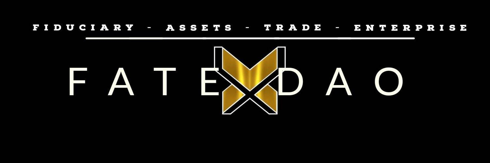

# FATExDAO

FATExDAO 是一个 100% 由会员经营的亲人类（ESG、多样性、社会责任、营利性企业）。
DAO 的 web 3.0 Dapp FATExDEX 目前已上线（请访问 FATEx.io - 请花点时间熟悉登录页面上的详细信息）。 FATExDEX 是一个数字资产托管机构，汇集 DAO 成员的资金，以建立一个盈利的商业金融科技和 DeFi 投资和银行机构。
FATExDAO 成员资本投资是一种在 DAO 的未来贡献和获得治理股权的方式，它保存和增长数字资产，提供具有大规模商业应用的 DeFi 金融服务和产品，通过创新产生财富/价值增加以公平、包容、无国界和符合 ESG 的方式开展经济活动。
DAO 的驱动力是使用战略性的唯赢解决方案来鼓励可持续和对社会负责的企业实践 - 产生前所未有的盈利潜力。
这与几乎任何其他 DeFi 项目都有很大不同。我们是第一个宣布回归数字化、经过调整的“金本位”储备“货币”的 DeFi 项目——有条不紊的执行计划。这一切的完成只是一个开始。我们希望你能加入我们——还有工作要做。

