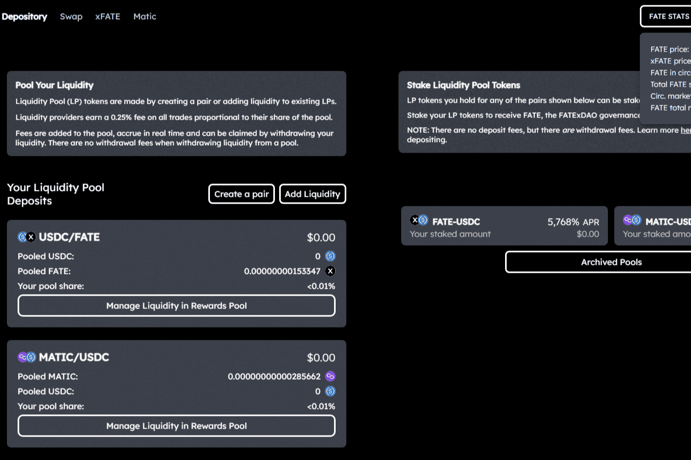

# FATExFi

FATExDAO 是在治理代币 FATE & FATExFi 下形成的 ESG/CSR 金融科技 DAO，基础层 DOA 治理 dApp：
FATExFi 重新格式化了传统的“dex”流动性池、排放奖励模型（通过一些重要的调整：代币经济学保护、可持续的价格价值合同结构和公平的费用），并将其用作收集成员出资并提供DAO 股权/治理权来自：$FATE。
FATExFi 帮助构建和托管正在构建的主要产品，以完成 DAO 的任务目标：
FxD：一种法定/外汇/加密货币支付面额和稳定、真正的真实价值存储代币和零售/移动/商业平台，具有重要的货币化用例，旨在完成比特币的起源。

