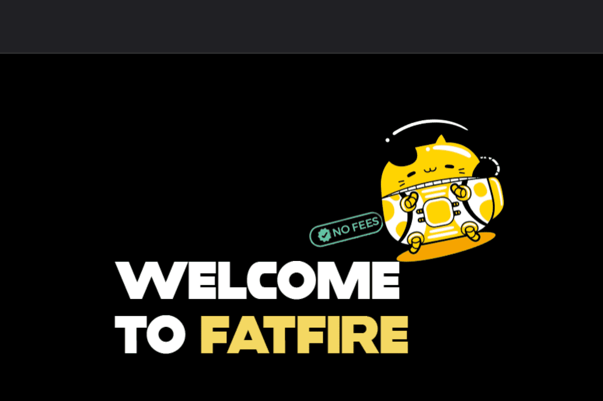

# FATFIRE FINANCE

一个智能的 Defi 代币和收益股权，Fantom 网络上的聚合器，具有自动燃烧和零存款费用的自动流动性。

“我有能力在包括世界旅行在内的优质奢侈品和体验上挥霍，”Teri Ijeoma 说，他是 Trade & Travel 的创始人，这是一个在线课程，教授股票市场交易的高级形式，以此作为创造补充收入的一种方式。 Ijeoma 在 38 岁时可以选择工作。

“当我担任副校长时，我躲在办公室里做交易，”她说。 “没想到，就在我的电脑宣布‘你的交易成功’的那一刻，我的老板走进来了。那天，我的一笔交易赚的钱比我一个月的工资还多。在那一刻，我知道交易是我的退出策略。”

Teri 的生活方式是 Fat FIRE 的一个例子，它是 FIRE（财务独立，提前退休）的增强版本，您预计每年的生活费用将超过 100,000 美元。如果您想提前退休，但又不想生活在紧张的预算中，那么 Fat FIRE 方法可能对您最有意义。如果有足够的时间和计划，有些人可以通过低成本、低风险的指数基金投资达到目标。

以下是您需要了解的有关如何实现 Fat FIRE 和实现财务独立的信息。

