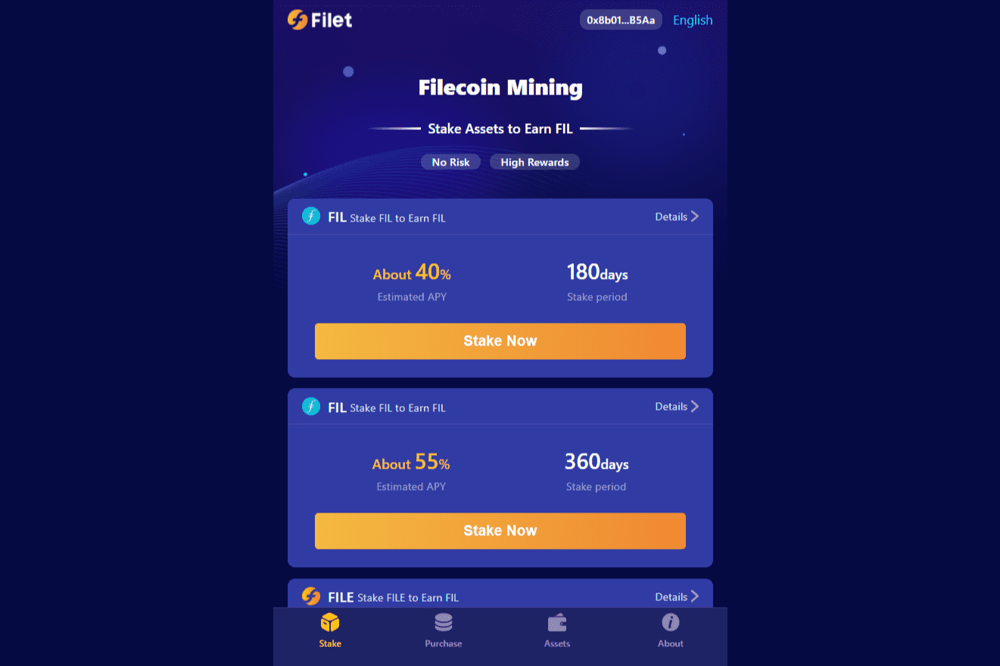

# Filet

Filet是部署在Filecoin、BSC(BSC)、HECO网络上的去中心化Filecoin挖矿平台。我们提供抵押服务，APY 约为 30%。 FIL 持有者可以在没有任何风险的情况下抵押 FIL 来挖掘 FIL。 Filet 是开源的，由 Certik 审核。

里脊沿着脊柱的两侧延伸，通常被屠宰成两条长长的蛇形肉块。里脊有时整块出售。菲力牛排通常呈现为从一块里脊肉较薄的一端切下的圆形切口。它通常是最嫩和最瘦的切口。菲力牛排通常比其他肉块具有更温和的味道，因此通常用酱汁装饰或用培根包裹。

由于可以从每只动物身上屠宰少量的菲力牛排，它通常是最昂贵的肉块。

