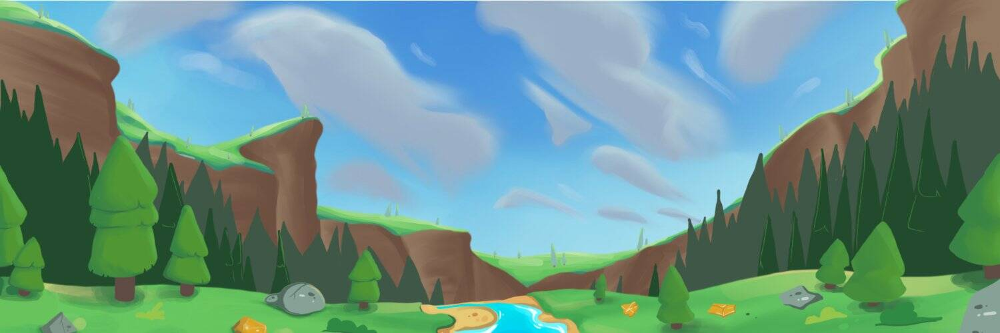

# Fishing Lands

Fishinglands 是由 Private Coding Company Limited 开发的 WAX 上的区块链游戏，以游戏赚钱的形式推出。首先，玩家需要拥有游戏中的工具，这些工具可以通过 AtomicHub 购买，与其他玩家交换，或从名为“Alcor Exchange”的去中心化交易所使用某些代币制作。该游戏允许玩家特别强调钱包内资源的管理。
在《Fishinglands》中，玩家将扮演一个狂热的渔夫，他痴迷于钓鱼，渴望拥有最好的鱼竿。每个玩家都将通过使用游戏中的资产来贡献并参与构建他们的多元宇宙。
我们坚信拥有这些资产是让玩家变得更有吸引力并被游戏吸引的方式之一。但是，玩家也会获得游戏内代币，这些代币可用于制作新工具或在 Alcor Exchange 中兑换。我们的目的是创建一个健康的经济系统，为游戏中的玩家提供多种机会。由于我们的代币经济学非常稳定，这说服了积极的投资者和游戏参与者参与到 Fishinglands 经济的角色中。

