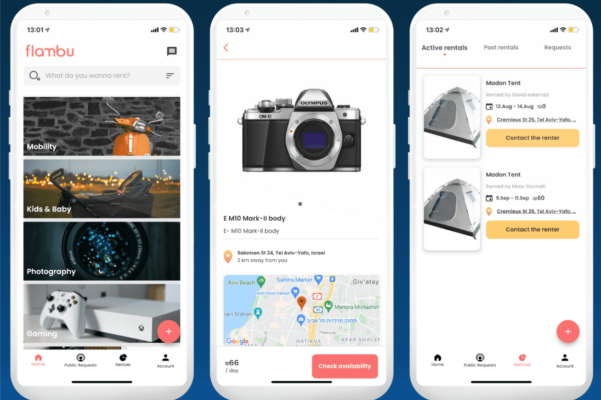

# Flambu

基于 Web3 的移动优先共享经济平台
当您需要物品来体验新事物或完成一项体力任务时，您可以在 Flambu 上找到它们。分享你拥有的东西以产生额外的收入，并从别人那里借你需要的东西来省钱。 Flambu 具有两个代币模型，用于增强 P2P 租赁任何东西，具有去中心化的信任和快速的低成本支付，任何人都可以成为利益相关者。
Flambu 中的代币经济学涉及两个代币：
Flame (FLAM)：FLAM 是 Flambu 的本地实用代币，有 3 个主要用途： 忠诚度：激励参与网络：奖励增值行为 保险：在 P2P 交易中创建和维护稳健的信任和保护，并具有补偿的锁定机制良好的交易结果和反不诚实行为
治理：关于 Flambu 的一切都是可治理的，投票权重与为增值服务质押的 $FLAM 直接相关
Flambucks (FBX)：FBX 是一种与美元挂钩的稳定代币，并由 USDC 和 FLAM 等其他稳定代币支持。 FBX 代币用于在 Flambu 平台上进行快速、廉价和安全的 P2P 支付。 Flambu 的用户将以当地（或选定的）法定货币查看他们的 FBX 代币余额

