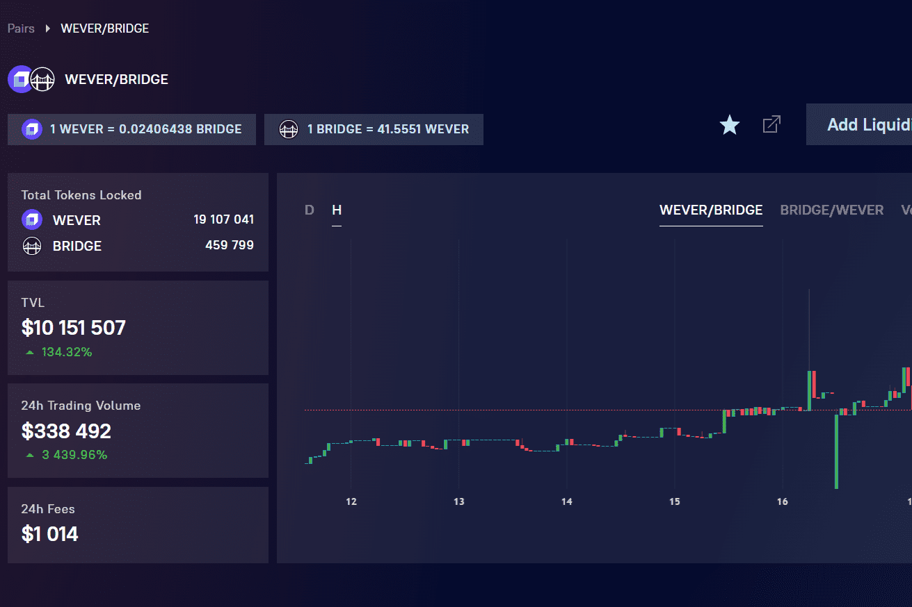

# FlatQube

FlatQube（例如 TON Swap）建立在快速增长的区块链 - Everscale（CMC 上的 TOP 239）之上。
-------关于Everscale网络的一点点-------
Everscale 是一个快速、安全和可扩展的区块链和网络项目，如有必要，每秒能够处理数百万笔交易，并且对用户友好且对服务提供商友好。人们可能会认为 Everscale 是一个巨大的分布式超级计算机，或者更确切地说是一个巨大的“超级服务器”，旨在托管和提供各种服务。
网站：everscale.network
--------关于FlatQube--------
FlatQube 是 Everscale 区块链上的第一个自动化做市商 (AMM)，拥有高 APY 农场。
AMM 允许在 Everscale 网络上快速、廉价地交换两种代币。
您可以在五个池中享受高回报：
1. LP WEVER/WETH
2. LP WEVER/WBTC
3. LP WEVER/USDT
4. LP USDT/USDC
5. LP WEVER/DAI
6. LP WEVER/USDC
7. LP WEVER/BRIDGE
8. LP WBTC/BRIDGE
9. LP 曲柄/桥
10. LP Qube/韦弗
--------关于QUBE代币--------
QUBE 是一种实用代币，旨在为 FlatQube 协议提供动力。
---质押QUBE以提高您的农业收益
根据质押的代币数量，持有者将能够增加他们的农业 APY。
---充分利用单产农业
使用 QUBE 交易对参与各种收益农业计划，以获得更多 QUBE 代币。
---参与 FlatQube 投票
对 FlatQube 生态系统中的不同重要决策进行投票或创建自己的投票提案。
---质押QUBE获得奖励
质押 QUBE 代币并获得更多 QUBE 代币的被动奖励。

