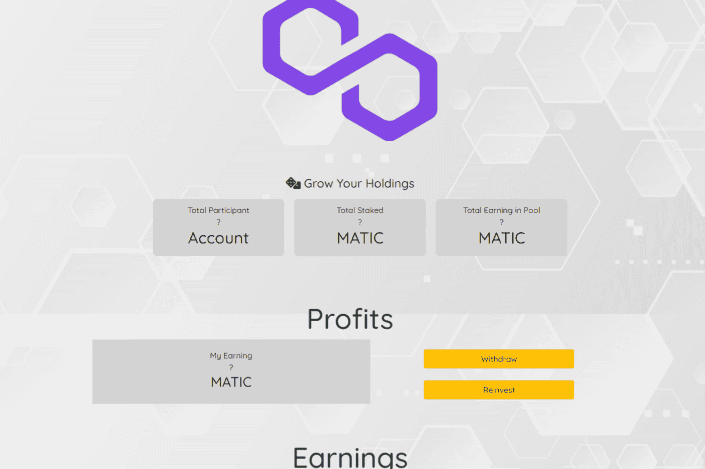

# Flipbiner

扭曲的 Fomo 游戏。 10% 进 10% 出 dapp，旨在通过长期投资池帮助在持有的同时产生更多 MATIC,Flip PDF Plus Corporate 是一款功能强大、功能丰富的翻书制作工具，带有多媒体编辑器。 使用视频、音频、链接和动画等多媒体创建数字翻书。 包括 40 多个热点、70 个按钮、13 个幻灯片、90 个形状和其他商业用途资产。 一个企业版许可证代码允许您的团队在 4 台计算机上激活它。 （更多座位请访问购买页面）。 它还提供 1 年免费 VIP 帐户，可将 1,000 本书上传到 FlipBuilder 服务器。

