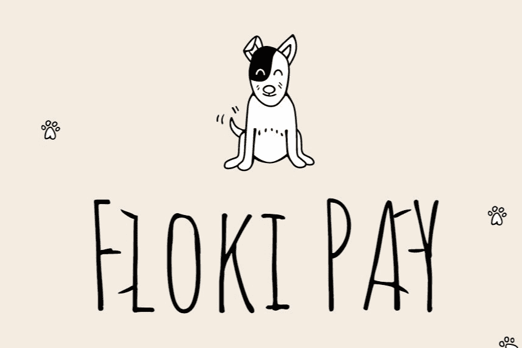

# Floki Pay

Floki Pay Wallet 结合了 ERC-1363 EIP，允许客户在电子商务商店和当地咖啡馆或餐厅使用加密货币，所有这些都只需几美分的费用。 我们的目标是提供去中心化、私密且即时的支付，只需几美分。Floki Pay 提供去中心化支付，无需独立第三方，如受托人、处理商、票据交换所、交易所和结算组织，省去了中间人。 无论您是支付或转账 5 美元或 100,000 美元，您只需支付几美分的转账费。 代币预售直播

