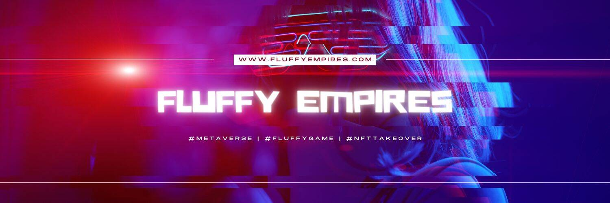

# Fluffy Empires

Fluffy Empires 是一款在 BSC（Binance）上进行的 3D 开放世界游戏。
Fluffies 是我们游戏以及相关生态系统中的主要参与者。每个 Fluffy 在外观和游戏统计数据方面都是完全独特的。
不仅有一种玩游戏的方式，还有几种不同的方式可供您选择。
体验带有 RPG 元素的游戏，您可以在其中决定自己想成为什么样的人。
以下是您可以玩游戏的一些方法：

  探索世界，建造和制作物品以在市场上出售
  与敌人 (PvE) 和其他玩家 (PvP) 战斗并登上排行榜以获得更好的奖励
  完成不同类型的任务并收集奖励
  购买地块，在其上放置建筑物并成立公司
  培育蓬松并创造出新的、独特的一代
  参加活动并炫耀你的绒毛

旅行和探索从森林到冬季白雪皑皑的不同土地。
一起玩或互相对抗！
在您的旅程中，您可以结识其他玩家，与他们一起解决任务或在竞技场中挑战他们。
然而，世界并不像最初看起来的那么平静。有许多强大的对手会阻碍你。

