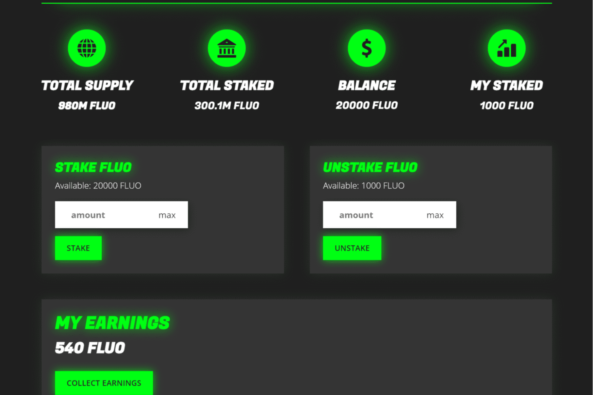

# Fluo

FLUO 是一种加密货币，旨在成为币安智能链上最可持续的项目。它结合了公平发行和完全无主流动性池等各种安全代币原则，以实现真正的长期可持续性。 FLUO 是为希望获得可质押、可证明公平的代币的投资者而设计的。
Fluo 使用自己的收入支持的质押机制，这意味着所有质押奖励完全由网络产生的收入支付。更进一步，我们决定使用 0 个团队代币并将 100% 的代币分发给公众（80% 通过代币销售，20% 通过 Pancakeswap）。 pancakeswap LP 代币（Pancakeswap 池的密钥）在上市后也立即被烧毁，使 Fluo 成为防“拉扯”的代币。

氟
打开 Dapp

氟
币安智能链上最可持续的加密货币。公平启动、通货紧缩、收入支持的质押、流动性锁定等。
