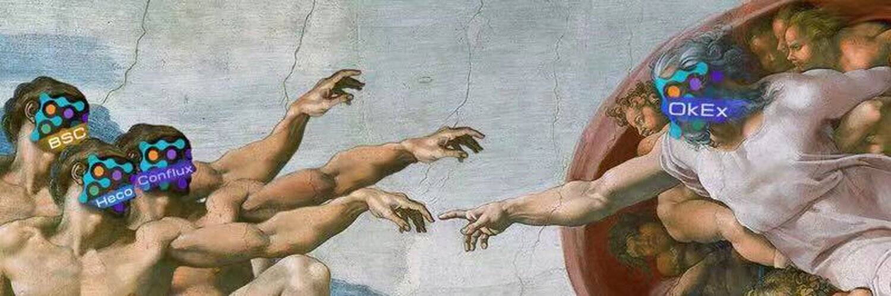

# Flux

关于通量
FLUX 由零一团队开发。 FLUX 是一种去中心化、安全、非托管的数字加密资产抵押借贷协议。在 FLUX 的货币市场中，用户可以存入特定的加密资产赚取利息，也可以通过抵押资产并支付一定的利息来借出特定的加密资产。
目前，FLUX 已在 Conflux、BSC、Heco、OKExChain 和 ETH 注册。未来，无损跨链借贷将在 Solana、Polygon、Arbitrum、Near 或 Layer2 等热门公链上实现。
与以太坊网络上的Compound、Aave等借贷产品相比，FLUX在利率模型、抵押模型、清算逻辑等方面进行了改进。同时合约调用成本低，执行效率高，用户体验好，发展潜力无限。在不久的将来，FLUX 将构建一个更丰富的去中心化借贷市场。
