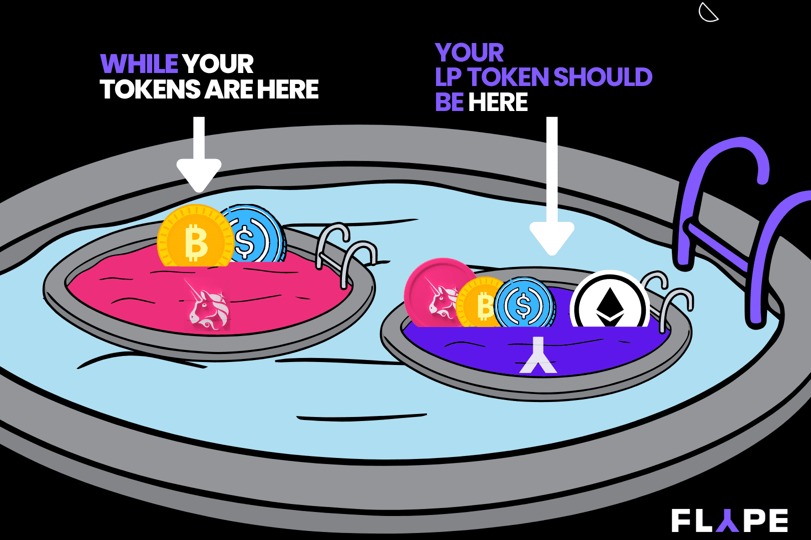

# Flype Protocol

HTML

使用 Flype，您可以： FLYP 代币经济学 代币拓扑
使用 Flype，现在可以直接交易价值 $200B 的锁定资产！
Flype 是一种独特的 dex 协议，它将 LP 代币从“数字收据”转变为可交易资产，创造了一个全新的市场。

  在一次交换中无缝更改不同池和协议之间的流动性头寸。
  仅通过将 ETH 换成 LP 代币来创建新的流动性头寸。
  仅通过将 LP 代币换成 ETH 来平仓您现有的头寸。
  节省高达 85% 的 Gas 费用。
  通过向 Flype 矿池提供 LP 代币作为流动性，在相同流动性头寸上赚取两倍的利润。

目前，要改变您的流动性头寸，您必须经过以下步骤：

  提取您的基础代币对
  将它们中的每一个交换为新的一对令牌
  将新的一对代币存入新池中

这个多步骤过程非常耗时，并且会产生高昂的汽油费。比使用 Flype 多六倍！
Flype 是由 FLYP 原生代币管理的社区驱动协议。 $FLYP 为整个协议经济提供动力，并激励流动性提供者、质押者和交易者。 FLYP 治理代币授权社区通过发布和投票提案来引领协议向前发展。
以下章节描述了 FLYP 代币如何在整个 Flype 生态系统中使用。
FLYP 生态系统由多个参与者组成。这些参与者相互交互，创建了一个依赖 FLYP 代币的功能性生态系统，以促进使用 Flype 协议的价值。

