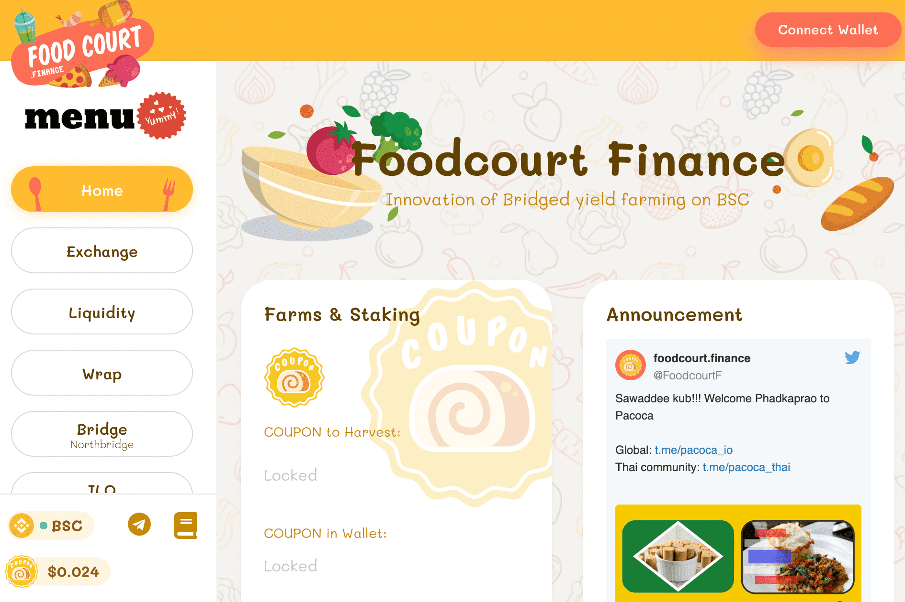

# Foodcourt Finance

Foodcourt 是币安智能链上领先的创新去中心化交易所（DEX），专注于成为最大的原生 ETH（原生币）交易所。激励用户通过收益农业在 Foodcourt 集中流动性以赚取本国货币 $COUPON。此外，客户可以使用他们赚取的 $COUPON 在我们的美食广场生态系统中使用（详细说明......）美食广场使用 KillSwitch（北桥）标准作为原生硬币，这将有助于解决客户想要跨界时流动性低的问题到其他链，例如 BSC 上的 KillSwitch 标准 kMatic，客户可以通过 LP 购买 kMatic 并使用桥接回到 Matic 链，kMatic 成为真正的 Matic Coin 未来 foodcourt 将列出所有具有 BIP39 钱包标准的原生代币，例如 ETH、Avalance ，Klaytn，heco，ont，fantom，和谐，xDAI。
