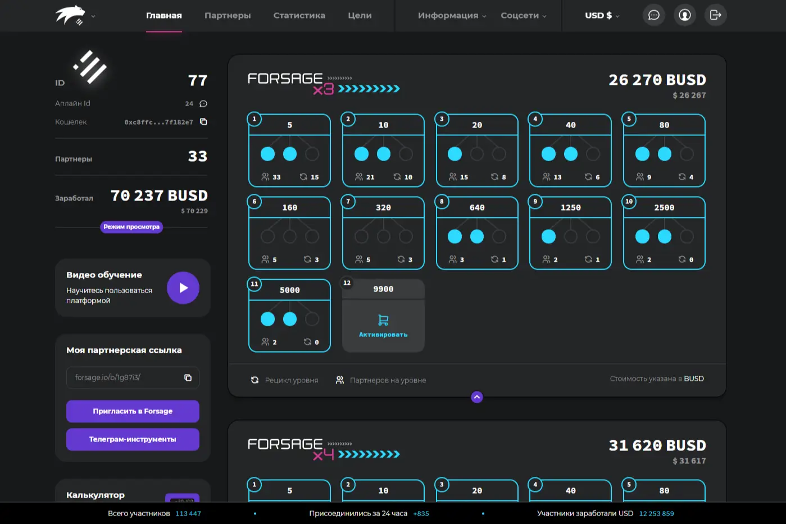

# Forsage BUSD

• 牧草 •
矩阵项目基于没有管理员的智能合约。资金仅在参与者的钱包之间自动转移。入场费从 10 美元到 1 万美元不等。具有自动再投资和溢出效应。
智能合约的革命性技术提供了去中心化营销。 FORSAGE项目的智能合约代码完全开放：
智能合约 x3 / x4
0x5acc84a3e955Bdd76467d3348077d003f00fFB97
智能合约 xXx
0x2CAa4694cB7Daf7d49A198dC1103C06d4991ae52
因此，您可以对项目的安全和长期运行充满信心。
FORSAGE 项目没有管理员。有一个创建者将合约代码上传到区块链。从那时起，智能合约一直是矿工支持的公共网络的一部分。任何人都无权影响、删除或停止智能合约的运行。由于与块中以前的副本不一致，任何进行未经授权的更改的尝试都将被拒绝。
未来就是现在！
