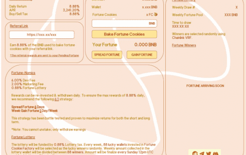

# Fortune Cookie Factory

关于：幸运曲奇工厂是由少数幸运曲奇大师经营的成功面包店。面包店配有多个设备齐全的大型厨房，您现在可以租用幸运饼干面包师，不停地为您制作幸运饼干。
赚取：扣除所有烘焙费用后，您每天将能够获得初始投资的 8.88%。
推荐：说服您的朋友租用厨房并获得他们总投资的 8.88%！
复合：重新投资您的每日奖励以雇用更多面包师，这将为您不间断地制作更多幸运饼干并成倍增加您的收入。
费用：8.88% 的幸运饼干投资和销售费用。 6% 开发，2% 营销，0.88% 财富彩票。重新投资奖励时不收取任何费用。
幸运彩票：彩票将由0.88％的彩票税资助。每周将随机抽取88个投资于幸运饼干工厂的幸运钱包作为幸运儿。每周在彩票钱包中收集的金额将为
分配给 88 名中奖者 金额将在世界标准时间每周日中午 12 点最终确定，之后将开始新的抽奖活动。
策略：一个成功的幸运饼干厨房每个都有一个幸运神照顾他们。本尊传运6
每周一次，让您每周获得 1 次财富。太频繁地发财会降低你的幸运饼干的发财能力，并降低你的短期和长期投资回报。

