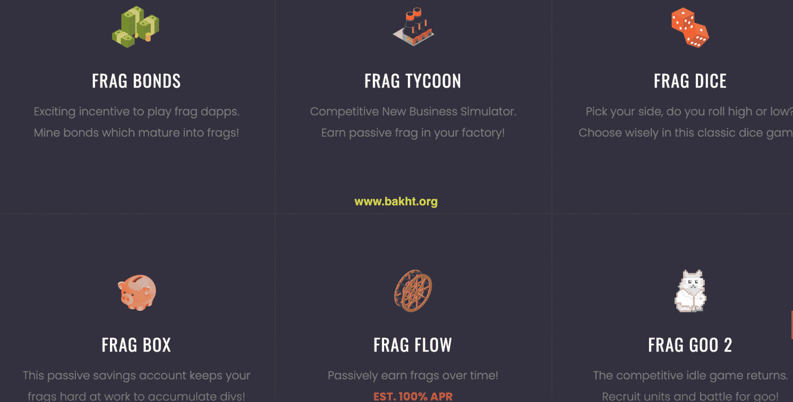

# FragDice

通过玩这款经典的骰子游戏，为 div 挖掘 FragBonds。 需要 $FRAG 代币才能玩（tron 上的 trc20 代币）。FragDice dApp 是一种基于 Tron 协议的赌博类别的加密资产。 现在，根据用户数量，它在一般 dApp 排名中排名第 7033 位，在赌博类别中排名第 694 位，这让您可以很好地了解 FragDice dApp 在其竞争对手中的表现。 通过分析过去 30 天窗口中的 FragDice dApp 数据，很明显 dApp 的余额为 0.00 美元，而交易量看跌，为 0.00 美元。 FragDice 在 30 天内产生了 35 笔交易，下降了 -40.68%。 显然，与之前的 7 天相比，成交量稳定了 0%。 最近 7 天的数据显示，FragDice 的用户群为 35 人，并且一直在下降 -62.5%。 我们还建议查看 FragDice 活动概览和智能合约余额图表，了解这些重要指标如何随时间波动和变化。

