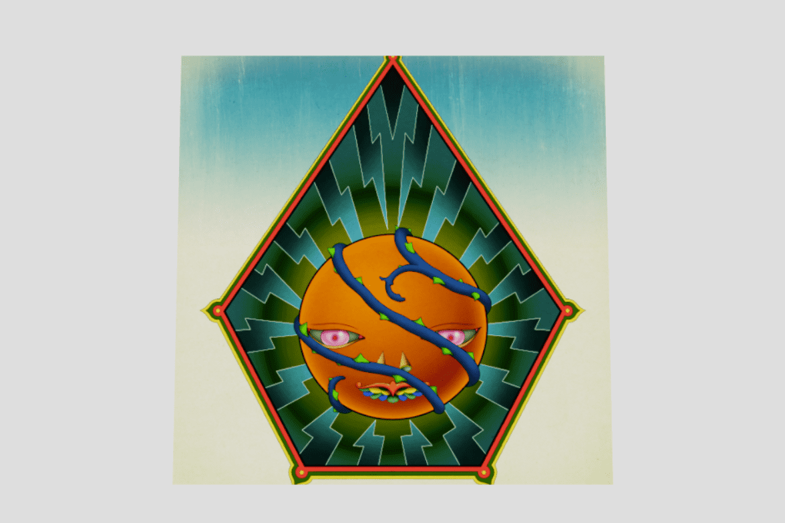

# Fragments By James Jean

多学科视觉艺术家 James Jean 展示了 Fragments (2022)，这是由数字艺术平台 Outland 委托的全新手绘数字艺术系列。 这个雄心勃勃的新系列的灵感来自艺术家即将建造的大型发光建筑展馆，名为 Pagoda，将由 7,000 块彩色玻璃组成。 碎片将被铸造为 7,000 个 NFT 的版本大小，以反映将于 2023 年亮相的物理雕塑。
Fragments 完全是手绘的，呈现了一系列从艺术家的想象中提炼出来的奇幻角色。 Jean 将这些描述为“神话人物”，每个角色在五边形框架上都有一个独特的角色，在他标志性的迷幻调色板中与宝塔玻璃面板的花瓣状形状相呼应。 Fragments 包含了 Jean 整个职业生涯中出现的视觉元素。

