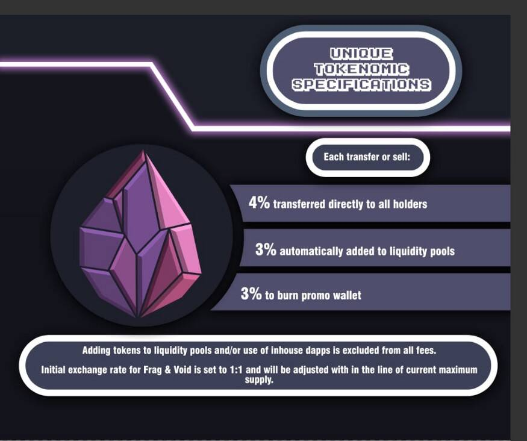

# FragTycoon

大亨为 Tron 网络带来了具有竞争力的商业模拟游戏。 如果玩家希望获得最大的 div，则必须保持工厂的高效率，这是通过为工厂提供日常维护来实现的。 培育您的商业帝国并获得奖励！ ?在这个竞争激烈的大亨游戏中主宰被动碎片收入！ 大亨奖励那些最致力于他们工厂的人！对存款收取 50% 的总交易费，40% 的手续费 工厂 div 池，每天支付 1% 的 div。 剩余的 10% 用于 5% 的即时 div 池，2% 的推荐奖励和 3% 的债券。

