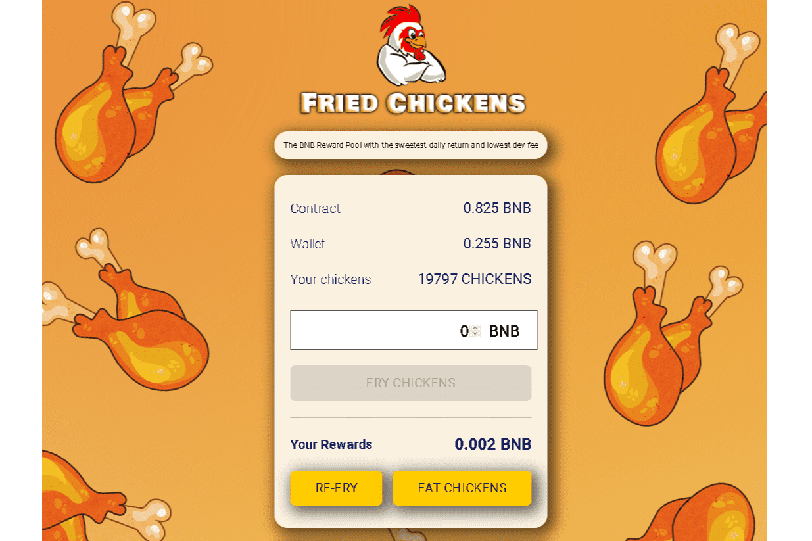

# Fried Chickens

什么是炸鸡？
炸鸡是 Token Miner 元的一个有趣的旋转。
我们的应用程序充当 BNB 奖励池，只要奖励池中还有 BNB，每天都会返回池中 8% 的 BNB！用户可以在积累时选择吃鸡（拿走 BNB 奖励）或重新炸鸡（复合赚取 BNB 奖励）。
只需炸鸡，享受我们独特的动画乐趣，并在炸鸡时享受您的炸鸡奖励！
合同
BNB Miner 合约经过验证、开源、不可变、可信赖，可在 www.bscscan.com 上查看
这一切意味着什么？
这意味着一旦部署了合约，合约就不再需要开发人员来继续按预期运行，而在 BNB Miner 的情况下，甚至不需要网站。每个人都可以阅读/审核并直接与代码交互，并根据自己的需要做出自己的决定。一旦部署了合约，任何人都不能以任何理由停止或更改它，甚至开发人员自己也无权更改或从合约中获取任何内容。
策略与信息
BNB Miner 不要与农场混淆。鸡矿工不是被买来的，他们是被雇佣的，因此不能被卖掉。一旦矿工被雇佣，他们就会无限期地为你工作，以每天 3% 的起始费率为你提供无限量的 BNB。
推荐系统
简单，当他们炸鸡时，您将获得 12% 的推荐人！

