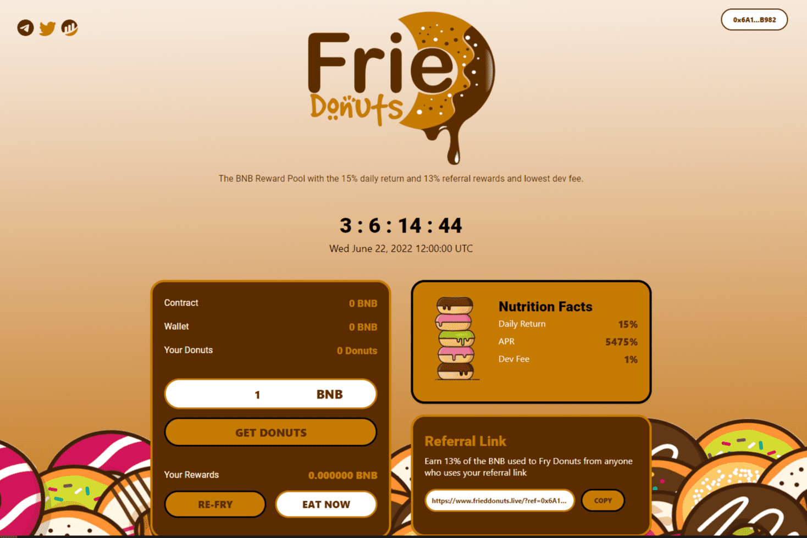

# Fried Donuts

币安智能链上的创新 DeFi 高达 15% 的每日回报和 13% 的推荐奖金 完全验证和审计的合约。
什么是“甜甜圈”？
甜甜圈是受雇于 BNB 并努力获得奖励的矿工。 这只是我们决定使用的一个术语。 加密 OG 将“甜甜圈”称为 BNB
费用是多少？
从 Fried Donuts 的所有存款和取款都会收取 1% 的开发费用。 每笔存款、取款和重炒交易都需要标准的 BSC 网络 Gas 费！
这是可持续的吗？
是的，只要合约中有 TVL，那么总会有奖励。 吃得太多的饥饿的人会受到惩罚，得到的奖励越来越少。 TVL越高，持续时间越长。
什么是最好的策略？
我们推荐合同中所写的久经考验的方法。 重炸 6 天，每周吃 1 天。 它将增加您的投资并在 3-5 周内收到您的初始回报

