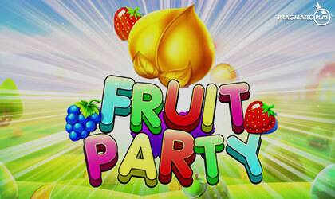

# Fruit Party

什么是水果派对？ Fruit Party 是在 Avalanche 网络上推出的 Baked Beans 分叉。我们创建了这个项目，旨在为世界提供一种有趣且简单的方式来赚取被动收入。
它是如何工作的？将 Avax 放入果盘后。您将开始每天获得 8% 的奖励。您还可以为您的水果榨汁并混合您的 Avax 并将其添加到水果碗中。您可以选择喝果汁，这意味着将 Avax 提取到您的钱包中。
这个项目的最佳策略是什么？通过坚持 6/1 的理念（6 天复利，1 提款，这对每个人都是双赢的，并长期支持协议。您可以随时堆叠您的奖励或每天领取，请注意每天 8%回报将开始减少。
是什么让水果派对与众不同？与任何其他烤豆叉不同，我们有一个独特的转折！我们将通过财政部支持合同。每笔交易产生的税款将用于建立我们将用于投资和支持各种协议中的合同的国库。我们与财政部的目标是阻止 TVL 的任何大幅下降。如果我们看到 TVL 大幅下降。我们将永久存入 Avax 并复合此 Avax。这个概念以前从未有人做过。我们相信这个概念将导致更长的寿命和 TVL 的

