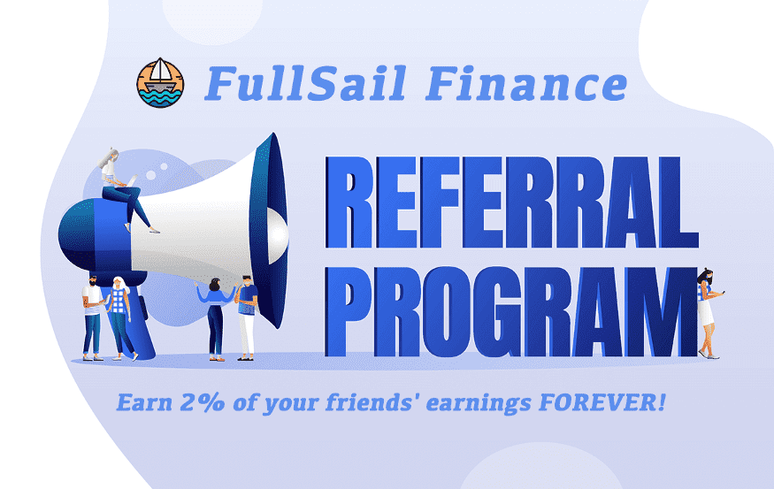

# FullSail Finance

BSC 上的第三代通缩收益农场和算法稳定币协议和 AMM 具有链上推荐计划,我们想让探索、跟踪和管理 dapps 对所有人都有洞察力、方便和有益。
我们从 2018 年开始，为全球受众带来了关于去中心化应用程序的高质量、准确的见解，并迅速成为值得信赖的行业来源。
今天，我们是 dapp 发现的起点——托管来自超过 48 个协议的 11964 个 dapp——提供全面的 NFT 估值和投资组合管理，并在数据主导、可操作的行业报告方面处于领先地位。

