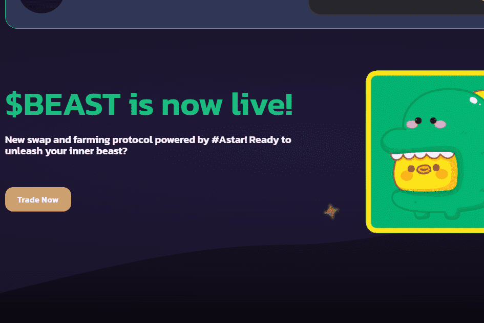

# FunBeast

FUNBEAST 是基于 Astar 构建的以社区为中心的 AMM 和 DEX。 我们的主要愿景是为我们的用户提供一站式的 Defi 平台。 FUNBEAST 提供 Astar 链上最低的交易费用。 我们的目标是创建一个一站式平台来满足我们用户的任何 Defi 需求。农场：用户可以在 BeastHunter 上质押他们的 FunBeast 和 Arthswap LP 代币，并获得我们的原生代币 HUNTER 作为奖励。 自动流动性池：Hunter 代币具有一个自我维持的流动性池，它以费用的形式从交易中吸收代币，并将它们添加到 Hunter 在 FunBeast DEX 上的流动性池中。这为代币增加了坚实的价格底线。 保险库策略：在我们的矿池中质押的 LP 代币将被部署到我们的策略合约中，并在我们合作伙伴的矿池中质押以产生收益，然后通过我们的收益共享保险库将其重新分配给 HUNTER 持有者。 收益共享保险库：HUNTER 持有者从我们的收益分享保险库中获得每日奖励。奖励来自 1/ 我们在质押池背后的策略 2/ 在影子农场之上应用的绩效费。目前，这些奖励是 BEAST 和 WASTR。

