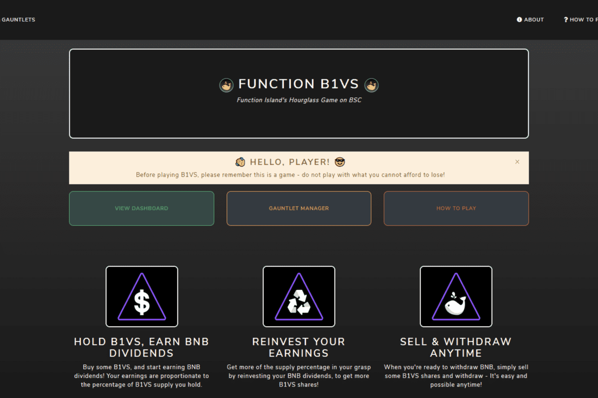

# Function Island B1VS

功能岛 B1VS 是“弱手证明”/沙漏合约的实现，附带“手套模式”。
正常播放：
购买一些B1VS，开始赚取BNB分红！您的收入与您持有的 B1VS 供应的百分比成正比。通过将您的 BNB 股息再投资来获得更多的供应百分比，以获得更多的 B1VS 股票！
当您准备好提取 BNB 时，只需出售一些 B1VS 股票并提取。
这很容易，随时可能！
玩手套：
选择将您的 B1VS 锁定的天数。通过存入 BNB 将一些 B1VS 添加到您的 Gauntlet - 您的 Gauntlet 将为您从沙漏合约中购买 B1VS，并将它们锁定到您设定的那一天！
将您的 Gauntlet 红利再投资是在此游戏中赚取更多收益的最快方式 - 当 Gauntlet 锁定时间结束时，您将能够出售其中的 B1VS 并将 BNB 提取到您的钱包中！当然，您也可以选择为您的 Gauntlet 添加更多天数，然后开始另一个循环！
B1VS沙漏是“功能岛”项目的最新扩展。该项目旨在以定制和独特的方式在多条链上提供持久、活跃的智能合约和 dapp。

