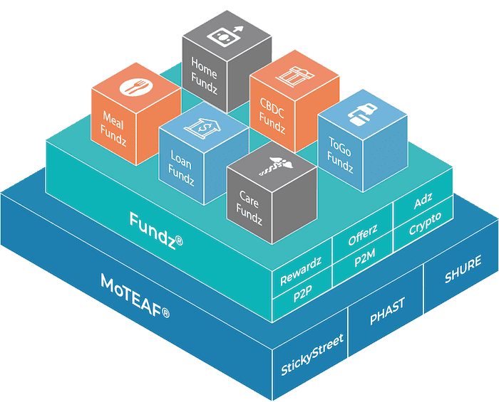

# Fundz Finance

Fundz Finance 是一个自主的非托管去中心化基金管理平台，是 Avalanche Network 上基金管理的支柱。该协议使用 TraderJoe 作为交易场所。
Fundz Finance 使其用户能够安全地创建/管理和加入去中心化基金，同时通过质押和耕作获得被动收入。
我们的协议在发布时提供以下功能：

  创建去中心化基金并赚取入场费和绩效费
  添加合作交易者或朋友来帮助您管理基金
  加入资金并在发生损失时获得抵押品保护
  Stake 和 Farm 分享激励奖励

