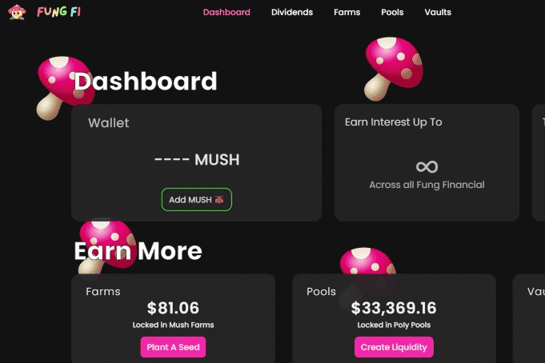

# FungFi

FungFi 是一个 DeFi 协议，专注于开发用于跨平台自动化收益和投资组合管理的高级工具。于 2022 年 4 月 26 日推出。从菌丝网络及其通过活的分布式网络智能移动资源的能力中汲取灵感； FungFi 在 DeFi 投资组合管理方面进行创新，并为 MUSH 代币持有者提供价值。
我们协议的第一阶段将看到我们分发 MUSH，为 Polygon 上的各个社区推出保险库，并为 MUSH 持有者设置股息分配。
第二阶段将专注于推出我们的旗舰产品：Networking Vaults。网络保险库将允许用户通过易于使用的 UI 将产量转发到额外的产量轴承产品。

