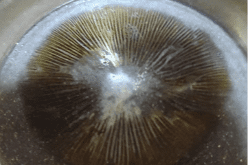

# Fungos.io

真菌来自英文中的“fungos”或“fungis”，这是“保存”在树脂中的孢子集合。就像人类的指纹一样，每个 &nbsp;孢子都是独一无二的，这就是它们的特别之处。自从培养它们直到收集到孢子。 &nbsp;并不是所有的真菌都以我们可以储存的方式出生，每 10 个蘑菇只收集大约 2 或 3 个给我们正确的孢子印。 &nbsp;但值得的是，看着他们长大然后永远被放在树脂里是 &nbsp;真正值得的东西。

