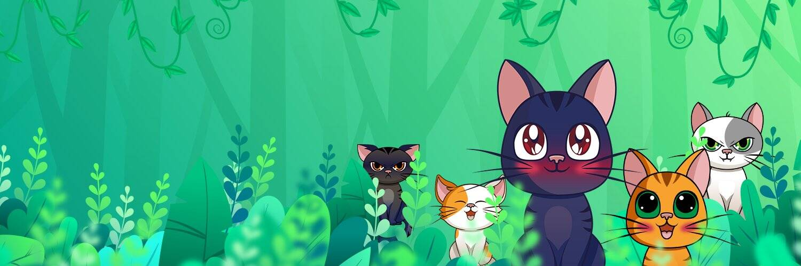

# FunnyCats - Staking

有趣的猫是一个拥有自己的质押系统和自己的代币的游戏项目。
我们的项目中有两种类型的卡片。
1. 收藏卡。
您已经可以在我们的网站上使用这些卡赚取 Catcoin。
2.游戏卡。
这些卡将是我们未来游戏所必需的。

Mila 不仅涵盖区块链和加密，而且她的大部分写作工作都集中在这项新兴技术上，以及它如何影响美国市场以及全球市场。从英属维尔京群岛到中国，她的报道不遗余力地提供全球加密货币。她对加密货币和区块链影响的坚韧和坦率的看法使她成为行业中的领军人物，也是好奇的大众的首要真相来源。

